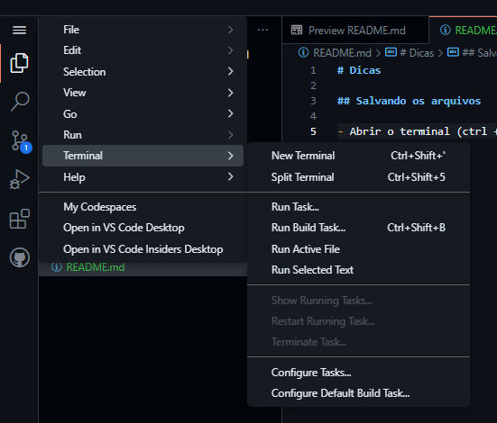
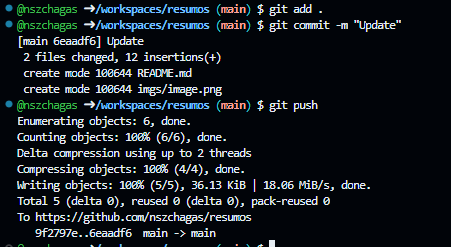

# Dicas

## Salvando os arquivos

- Abrir o terminal (ctrl + shift + ') ou no caminho da imagem:

- Digitar o comando (e dar enter no final): `git pull`
  - Atualiza a sua versão do código
- Digitar o comando (e dar enter no final): `git add .`
  - Adiciona todos os arquivos da pasta corrente (.) para serem commitados
- Digitar o comando (e dar enter no final): `git commit -m "Update"`
  - Commita os arquivos
- Digitar o comando (e dar enter no final): `git push`
  - Manda as alterações para o github

## Gerar os pdfs

Rodar no terminal, na pasta M4, o comando:
`./scripts/get_pdf docs`

## Dicas Terminal

- TAB uma vez completa o comando.
- TAB duas vezes mostra as opções para completar o comando.

## Dicas VS Code

- Selecione o texto que quer em negrito, e digite asterisco.
- Para formatar o arquivo `shift + alt + f`
- Para abrir os atalhos do teclado: `ctrl + k + s`

## Colar imagem

- Para colar a imagem use o atalho `ctrl + alt + v`, a imagem vai aparecer dentro da pasta "assets" dentro do caminho atual, com o nome mmss (minutos segundos).

Exemplo:

## Comando para abrir o site:

`python -m pipenv run mkdocs serve`

## Texto colorido

teste 1

teste 1

teste 2

**teste 3**