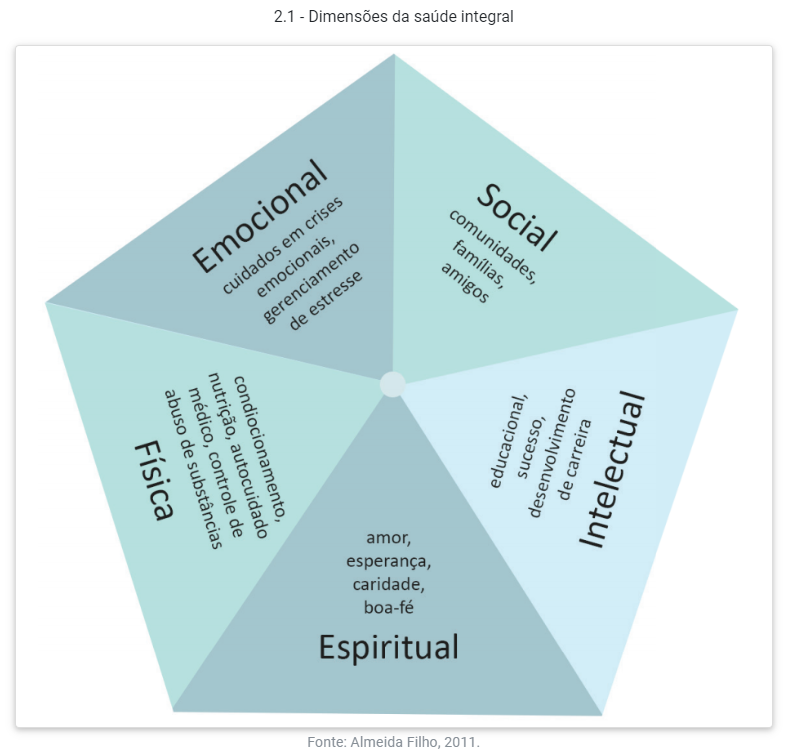
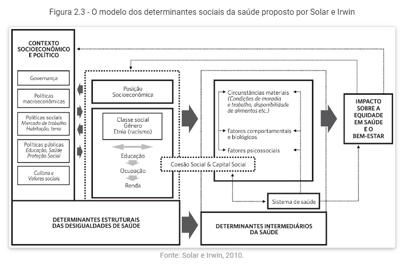

# M4D2 - SAUDE COLETIVA

**PROF**: SAMARA HADDAD

**TUTOR**: Jéssica dos Santos Folha - <jessica.folha@p.ucb.br>

**AULAS SÍNCRONAS**: 30/10 - 13/11 - 27/11 - 11/12

[TRILHA DO ESTUDANTE](https://ava.catolica.edu.br/d2l/le/enhancedSequenceViewer/66782?url=https%3A%2F%2F211c9f77-18c9-42e7-a7d8-b67813cc574d.sequences.api.brightspace.com%2F66782%2Factivity%2F1133024%3FfilterOnDatesAndDepth%3D1)

## UNIDADE 1

### HISTÓRICO

CUIDAR/CUIDADO

> o cuidado como um fator de sobrevivência e necessidade humana, por sermos seres sociais.

_Reflexão_: Apenas os seres humanos tem esse instinto de cuidado?

#### PRÉ HISTÓRIA

> Os seres humanos são dependentes dos conhecimentos que foram passados geração após geração. (...)
> O sobrenatural ou pensamento mágico ou místico reinava nesse período. Tudo estava ligado à religiosidade ou espiritualidade, inclusive os aspectos relacionados à saúde e à doença.

Uso de plantas medicinais, ervas eméticas e rituais de cura - como trepanação de crânio.

#### ANTIGUIDADE

EGÍPCIOS: Plantas medicionais, mumificação e escolas de saúde ligadas à religião;

ÍNDIA ANTIGA (200 a.C.): estudo do pulso, exames de urina, fezes, escarro e vômito, parto cesáreo, amputações, rinoplastia indiana, hospitais e plantas medicinais.

MESOPOTÂMIA: hepatoscopia, plantas medicinais e sacerdotes de cura.

CHINA: medicina tradicional chinesa (baseada no yin yang), acupuntura e práticas integrativas de saúde.

GRÉCIA ANTIGA: pensamento simbólico e virtudes relacionadas aos vários deuses, preferiam remediar a doença

> O deus grego Asclépio (ou Esculápio, em latim) representava o deus da medicina e da saúde. Segundo a mitologia, Asclépio se casou com Epíone, a deusa calmante da dor, e tiveram vários filhos, incluindo a presença de duas irmãs que disputavam entre si. As irmãs eram Panaceia, a deusa da cura, e Higeia, a deusa da preservação da saúde.

ROMA ANTIGA: cirurgias, descrição do sistema nervoso central

#### IDADE MÉDIA

Pouco desenvolvimento da saúde; proibições pela Igreja: sem acesso a cadaveres, doença era pecado ou falta de fé; prescrições: rezas, exorcismos, imagens santas

#### IDADE MODERNA

- Doenças infecciosas: peste negra, sífilis, febre tifóide.
- Ferimentos por arma de fogo.
- estudos de anatomia por desenhos
  - compilados e enciclopedias
- microscópios

#### IDADE CONTEMPORÂNEA

> A Idade Contemporânea, especialmente no século XVIII, foi marcada por um período de gigantes transformações na estrutura da sociedade (mudança do campo para as cidades), desenvolvimento industrial e tecnológico (revolução industrial), maior capacidade de transporte (criação da máquina a vapor) e do desenvolvimento do sistema capitalista. O período gerou muita miséria e fome (...) A caridade e cuidados gratuitos com a saúde eram realizados nas Santas Casas de Misericórdia da Igreja Católica, o que era muito pouco, já que a maior parcela da população não tinha nenhuma assistência à saúde.

No séc XVIII passou a pensar a saúde pública, como parte do cuidado com a mão de obra que o capitalismo precisava.

- evitar uma nova peste negra / epidemia
- pioneiros: Inglaterra, França, Alemanha
- medicina da força de trabalho (ING) - apenas quem tinha carteira assinada
- medicina urbana (FR) - eliminação de cortiços e moradores de rua
- medicina de polícia (GER) - população era obrigada a cumprir medidas autoritárias do Estado
- EUA: mercantilização da saúde

### CONCEITOS

| MODELO BIOMÉDICO                                                     | MODELO BIOPSICOSSOCIAL                                                                               |
| -------------------------------------------------------------------- | ---------------------------------------------------------------------------------------------------- |
| Formação de especialistas, biologicismo, individualismo, curativismo | Generalista, considera fatores sociais e psicológicos, integralidade do paciente, trabalho em equipe |
| doença é alteração no corpo                                          | doença é multifatorial                                                                               |
| saude é ausência de sinais e sintomas                                | saude não é apenas ausência de doenças, mas considera questões sociais e psicológicas                |

#### DOENÇA

> um conjunto de respostas desarmônicas do organismo frente aos estímulos patológicos (fatores causais ou etiológicos) (...) pode ser investigada por meio da descrição dos sintomas e da observação dos sinais clínicos.

- caráter objetivo
- prevenção

#### SAÚDE

> A Organização Mundial da Saúde (OMS), em 1947, conceituou saúde como “o completo bem-estar físico, mental e social, e não somente a ausência de doenças ou enfermidades” (OMS, 2006).

- subjetivo
- não da pra medir o nivel de saude do indivíduo
- não é necessário que seja **completo**
- a sociedade não é saudável
- qualidade de vida

##### DETERMINANTES SOCIAIS DA SAÚDE

_Classe social, renda, escolaridade, acesso à educação, cultura, informação, esporte e lazer_

Modelo que leva em consideradarção os determinantes sociais da saude juntamente das desigualdades e os determinantes intermediários:

#### SAUDE-DOENÇA-CUIDADO

- processo complexo e multifatorial
- intersetorial: vários setorews da sociedade
- escolas, universidades, igrejas, centros comunitários

## UNIDADE 2

> Para defender o SUS é preciso ter também empatia com as pessoas que dependem exclusivamente do atendimento na rede, ou seja, não possuem acesso às clínicas, laboratórios ou hospitais particulares, o que equivale a mais de 70% da população brasileira.

> é preciso entender que o SUS é um jovem sistema, nascido em 1988, pouco antes do Brasil fazer 500 anos. Ou seja, foram quase 500 anos de negação da saúde pública como um direito de todos.

### HISTÓRIA DA SAÚDE PUBLICA NO BRASIL

[HISTÓRIA DA SAÚDE PUBLICA NO BRASIL](https://www.youtube.com/watch?v=L7NzqtspLpc)

1. Quando a saúde pública foi criada pela primeira vez no Brasil? **No início do século XX**
2. O modelo adotado por Getúlio Vargas até a criação do SUS foi o modelo de medicina da força do trabalho; explique o porquê. **Politicamente, Getúlio Vargas focava na valorização do sistema capitalista através da mão de obra, e agia como um representante do povo e das suas necessidades para atender o sistema, ao mesmo tempo que controlava a sociedade com diversas leis. Assim, aqueles que trabalhavam na forma da lei, com carteira assinada e seguindo todas as normas estabelecidas eram considerados cidadãos e tinham o suporte do governo quando se tratava de saúde, através de contribuições percentuais mensais do salário.**
3. Houve um evento de saúde pública que marca o modelo de medicina de polícia; diga qual foi esse evento. **Foi a campanha de vacinação de 1904, que culminou na revolta da vacina**
4. O que foi a reforma sanitária brasileira? Faça uma busca na internet sobre o assunto.

#### BASES DO SUS

_Artigo 196 da CF/1988_

- princípio da universalidade - para todos, dever do estado
- princípio da integralidade - promovida, protegida e recuperada
- NÃO É UM DIREITO IMEDIATO
- é programático, construido e melhorado com o tempo

_Artigo 197 da CF/1988_

- regulamentação das ações de saúde
- fiscalização
- controle
- dereto ou através de terceiros
- pessoa física ou jurídica

_Artigo 198 da CF/1988_

- princípio da descentralização
  - autonomia política
  - rede regionalizada
  - doenças diferentes em regiões diferentes
- atendimento integral
  - atividade preventiva como prioridade
- participação da comunidade
  - diálogo
  - conselhos de saúde
  - conferencia de saúde
- princípio da hierarquização
  - Divisão por complexidade
  - atenção primária, secundária e terciária
  - 1ª pra 2ª, 2ª pra 3ª - chama-se referência
  - 3ª para 1ª de volta - contrarreferência

_Artigo 199 da CF/1988_

## UNIDADE 3

## UNIDADE 4

## AVALIAÇÕES

### FÓRUM - ATÉ 22/11

- [ ] FEITO
- [ ] POSTADO

Segundo o Ministério da Saúde (2022), “o Sistema Único de Saúde (SUS) é um dos maiores e mais complexo sistema de saúde do mundo”... que possibilita o atendimento integral, efetivo e gratuito da população brasileira, garantindo um acompanhamento universal ao cidadão nos vários níveis de complexidade, sendo uma referência mundial em prevenção e promoção em saúde coletiva.
Em paralelo, a população atendida possui uma percepção bem diferente em relação aos serviços prestados pelo SUS.

Nesse sentido, vamos construir uma discussão que identifique os principais problemas relacionados à ineficiência do Sistema Único de Saúde (SUS), analisando as suas principais causas e deficiências.

Critérios de avaliação:

- Cada estudante deverá fazer, NO MÍNIMO, 2 (duas) intervenções/participações.
  - Intervenção 1: responder as questões motivadoras do fórum (0,7).
  - Intervenção 2: comentar a resposta de um colega de turma de maneira crítica e reflexiva (0,3).

### QME - UN 2 - ATÉ 29/11

- [ ] FEITO

### ATV ABERTA - ATÉ 22/11

- [ ] FEITO
- [ ] POSTADO

### QME - UN 4 - ATÉ 29/11

- [ ] FEITO

## REFERÊNCIAS

- [ ] [RELATÓRIO FLEXNER](https://www.scielo.br/j/rbem/a/QDYhmRx5LgVNSwKDKqRyBTy/?format=pdf&lang=pt)

- [ ] [DO MODELO BIOMEDICO AO BIOPSICOSSOCIAL](https://www.scielo.br/j/rbem/a/63Ck5wPNn4gxyN39SZfCZsv/?format=pdf&lang=pt)

